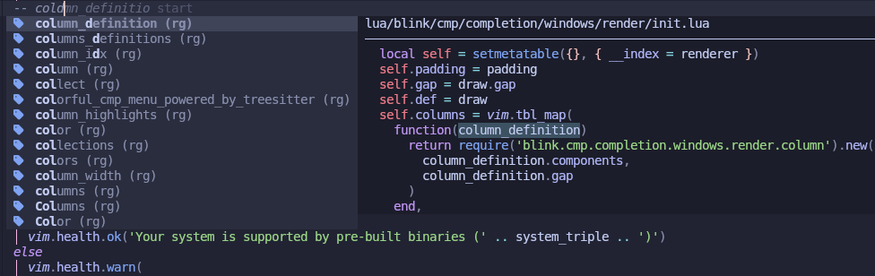

# blink-ripgrep.nvim

<a href="https://dotfyle.com/plugins/mikavilpas/blink-ripgrep.nvim">
  
</a>

Ripgrep source for the [blink.cmp](https://github.com/Saghen/blink.cmp)
completion plugin. Adding it to your configuration offers matching words from
your entire project as completions. This can reduce the chance of typos as well
as repetitive typing.

> [!NOTE]
>
> A project root is considered to be the nearest ancestor directory containing a
> `.git` directory. If none can be found, neovim's current working directory is
> used.



Forked here (mikavilpas/blink.cmp) for my own use from
[niuiic/blink-cmp-rg.nvim](https://github.com/niuiic/blink-cmp-rg.nvim).

## 📦 Installation

The configuration of blink-ripgrep needs to be embedded into the configuration
for blink. Example for [lazy.nvim](https://lazy.folke.io/):

```lua
-- NOTE: you can leave out the type annotations if you don't want to use them

---@module "lazy"
---@type LazySpec
return {
  "saghen/blink.cmp",
  dependencies = {
    "mikavilpas/blink-ripgrep.nvim",
    -- 👆🏻👆🏻 add the dependency here
  },
  ---@module 'blink.cmp'
  ---@type blink.cmp.Config
  opts = {
    sources = {
      completion = {
        enabled_providers = {
          "lsp",
          "path",
          "snippets",
          "buffer",
          "ripgrep", -- 👈🏻 add "ripgrep" here
        },
      },
      providers = {
        -- 👇🏻👇🏻 add the ripgrep provider config below
        ripgrep = {
          module = "blink-ripgrep",
          name = "Ripgrep",
          -- the options below are optional, some default values are shown
          ---@module "blink-ripgrep"
          ---@type blink-ripgrep.Options
          opts = {
            -- For many options, see `rg --help` for an exact description of
            -- the values that ripgrep expects.

            -- the minimum length of the current word to start searching
            -- (if the word is shorter than this, the search will not start)
            prefix_min_len = 3,

            -- The number of lines to show around each match in the preview window.
            -- For example, 5 means to show 5 lines before, then the match, and
            -- another 5 lines after the match.
            context_size = 5,

            -- The maximum file size that ripgrep should include in its search.
            -- Useful when your project contains large files that might cause
            -- performance issues.
            -- Examples: "1024" (bytes by default), "200K", "1M", "1G"
            max_filesize = "1M",
          },
        },
      },
    },
  },
}
```
